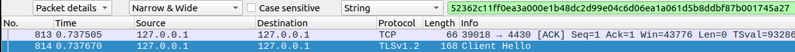
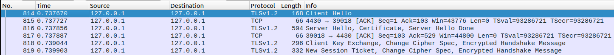
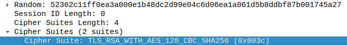
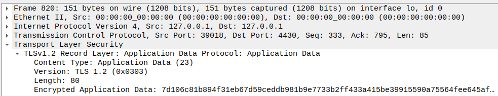
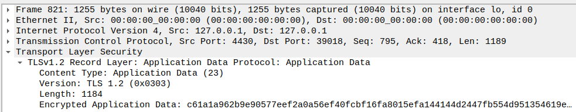
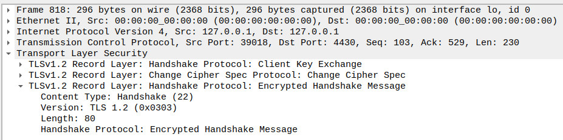

# CTF13 - FIND-MY-TLS

## Introduction

TLS is a cryptographic protocol designed to provide secure communication over a computer network, establishing a secure connection between a client and a server. It is used in HTTPS to encrypt the data transmitted between the browser and the server, ensuring confidentiality, integrity, and authentication of the exchanged information.

For this ctf, we were given a file, dump.pcapng, that we had to open using wireshark and search to find the desired information, which was:
- <frame_start> and <frame_end>: The first and last (respectively) frame numbers corresponding to the TLS handshake procedure.
- <selected_cipher_suite>: The name of the chosen cipher suite for the TLS connection.
- <total_encrypted_appdata_exchanged>: The total sum of the size of encrypted data exchanged over the channel until its termination.
- <size_of_encrypted_message>: The size of the encrypted message in the handshake that concludes the handshake procedure.

The flag had the structure ``` flag{<frame_start>-<frame_end>-<selected_cipher_suite>-<total_encrypted_appdata_exchanged>-<size_of_encrypted_message>} ```

We were interested in finding out more about the connection where the random number used in the handshake was ``` 52362c11ff0ea3a000e1b48dc2d99e04c6d06ea1a061d5b8ddbf87b001745a27 ```

# Constructing the Flag

Opening wireshark and pressing ``` ctrl + F ```, we can search specific values in the frames. After setting the search type to string and entering the number, we find out that our frame is 814.



``` <frame_start> = 814; ```

From studying the protocol, we also know that the handshake ends when the server sends a ``` New Session Ticket ```
Therefore:



``` <frame_end> = 819; ```

To find out the ciphersuite, we look for the ciphersuite field in frame 814 and find ``` TLS_RSA_WITH_AES_128_CBC_SHA256 ```



``` <selected_cipher_suite> = TLS_RSA_WITH_AES_128_CBC_SHA256; ```

To know the ```<total_encrypted_appdata_exchanged>```, we look at the length fields of frames 820 and 821, and add them, reaching 1264.





```<total_encrypted_appdata_exchanged> = 1264; ```

Lastly, the ```<size_of_encrypted_message>``` is  just the length field of frame 818, that concludes the handshake, which is 80.



```<size_of_encrypted_message> = 80; ```

Putting it all together, we get the flag:

``` flag{814-819-TLS_RSA_WITH_AES_128_CBC_SHA256-1264-80} ```

