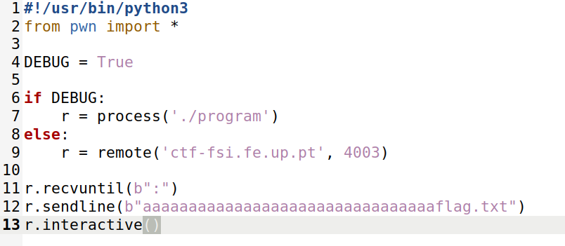

# CTF5

The primary objective of this Capture The Flag (CTF) challenge is to exploit a buffer overflow vulnerability in the program, ultimately gaining unauthorized access to the flag stored in the 'flag.txt' file, which is otherwise inaccessible.

## Challenge 1

In this challenge, we were given a zip file where we had an executable (program), a source code (main.c) and a python script (exploit-example.py).
We also had access to the following information below by running the following command:

```SHELL
checksec program
```

```
Arch: i386-32-little
RELRO: No RELRO
Stack: No canary found
NX: NX disabled
PIE: No PIE (0x8048000)
RWX: Has RWX segments
```

We started by analising the source code to understand the following points:

- *Is there any file that is opened and read by the program?*
    - Yes the mem.txt file is opened and read by the program as we can see in the figure below.


- *Is there any way of controlling the file that is opened?* 
    - Yes, by changing the meme_file variable's content, we can control which file is read and opened.

- *Is there a buffer-overflow vulnerability? If yes, what can you do?*
    - Yes there is. The buffer has 32 bytes but the scanf will read 40. We also know that the meme_file variable has 8 bytes and is positioned before the buffer in memory. Therefore, by overwriting the buffer we can modify the meme_file variable in order to open the file that we want to.


### Do the exploit

After answering the questions above, we had all the information needed to do the exploit.
By opening the exploit-example.py and changing the DEBUG to True we had the output showned in the images below. 


We initially attempted to inject 32 characters, corresponding to the 32-byte buffer size, followed by the filename 'flag.txt' to access it.


Upon executing this initial exploit, we observed the output 'flag_placeholder'.



Therefore we switched the DEBUG back to False and re-executed the exploit, successfully obtaining the flag.


## Challenge 2

In this challenge, we were given a zip file where we had an executable (program) and a source code (main.c). We could also adapt the python script of the challenge above to this challenge.


We also had access to the following information below by running the following command:

```SHELL
checksec program
```

```
Arch: i386-32-little
RELRO: No RELRO
Stack: No canary found
NX: NX disabled
PIE: No PIE (0x8048000)
RWX: Has RWX segments
```

We started by analising the source code to understand the following points:

- *What modifications were implemented?*
    - We observed that the 'meme_file' variable now has an extra byte, the 'scanf' function reads 45 bytes instead of the previous 32, and a new variable 'val' with 4 bytes was introduced.

(**print 2_2**)    

- *Do these changes fully resolve the issue?*
    - No, these changes enhance security by requiring the correct value to access the flag. However, if the correct value is obtained, access to the flag, which should be inaccessible, is still possible.

- *Is it possible to overcome those changes by using a similar aproach of the Challenge 1?*
    - Yes, we can still inject the 32 characters in the buffer followed by the name of the file we want to access (flag.txt). However, the correct value for the val variable must be placed between these two elements. This is because the value of the variable is checked immediately after the scanf operation.


### Do the exploit

After answering the questions above, we had all the information needed to do the exploit.
We then proceeded to run the exploit-example.py under both DEBUG settings, both False and True, and the outputs are the ones below.

(**print 2_3**)

(**print 2_4**)

To gain access to the flag stored in the file, we began by following the same approach as in the previous challenge, attempting to inject 32 characters along with the desired filename ('flag.txt'). Then we tried to identify the correct value for the val variable, which needed to be placed between the characters and the filename to successfully execute the exploit. 
Initially the val variable contains the hexadecimal value '0xdeadbeef' which was stored in memory as four bytes: 'ef be ad de' in little-endian format. However, we also know that in order to access the flag.txt file, the variable val had to be equal to '0xfefc2324'. Therefore, in the exploit, we inserted the bytes '\x24\x23\xfc\xfe', which the program interpreted in the same little-endian format. As a result, our input overwrote the initial value of the variable, setting it to '0xfefc2324'. This value allowed us to satisfy the if statement condition and gain access to the file we wanted.

(**print 2_6**)


After correctly inserting the input, we re-executed the python script and successfully obtained the flag.

(**print 2_5**)
