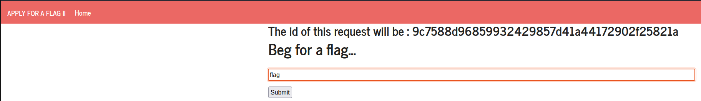
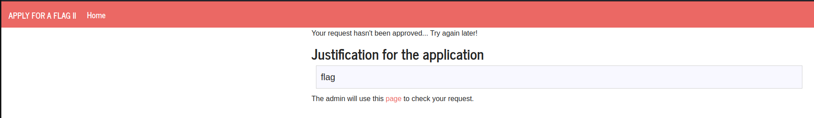
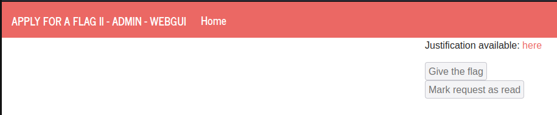
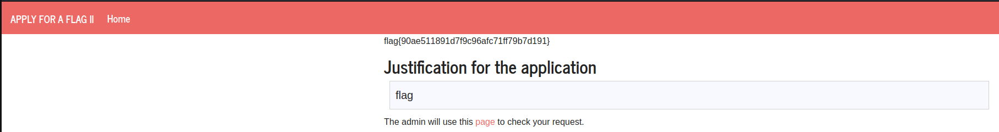

# CTF6 - XSS + CSRF

The primary objective of this Capture The Flag (CTF) challenge is to attack a website using XSS and CSRF, gaining access to the flag.

## The Exploit
Firstly, we need to ask to ask for a new flag. Remember the request id at the top of the page, as it will be important down the line.



After that, we reach the following page:


If we press the link over **page**, we will get access to the admin page, but we won't be able to do anything.


Here is where we start the exploit.

While maintaining the admin tab opened, we open another tab to create a new request.

In the text box, we input the following code:

```html
<form method="POST" action="http://ctf-fsi.fe.up.pt:5005/request/9c7588d96859932429857d41a44172902f25821a/approve" role="form">
<div class="submit">
<input type="submit" id="givetheflag" value="Give us the flag"> </div>
</form>
<script>document.getElementById("givetheflag").click();</script>
```

After that we press submit, which will lead us to a forbidden page, but our work is done.


## The Result

To see the flag, all we have to do is go back to the admin tab and press **here**.

If the exploit was performed correctly, we should see the flag on top of the text box with our original input.



## Explanation

How does this exploit work?
Let's first check our script:
- Within the form, there's a hidden input field with an "id" attribute set to "givetheflag" and a value of "Give us the flag."
- After the form, there's a JavaScript snippet that triggers a click event on the hidden input field.

When the user opens this page in their browser, the embedded form makes a POST request to the specified URL automatically as a result of the JavaScript code.

The browser automatically includes any cookies associated with the target site in the request headers. In a real-world scenario, this would typically include the user's session cookies.

The form injects malicious code that targets a specific URL with a CSRF token (the request ID ),making it appear as though the action is legitimate and coming from the user's session.

The CSRF part takes advantage of the fact that the browser automatically includes the user's session cookies with the request, making it look like a legitimate request from them. The server accept the requests and performs the intended action, which is giving the user the flag in this case.

## Possible Countermeasures

Some suggestions of security measures to prevent attacks like this are:

- Proper input validation and output encoding to prevent XSS attacks - we could use, for example, a regular expression. For example [a-bA-B]{26}.
- CSRF tokens to ensure that actions on the server are initiated by the user rather than an attacker.
