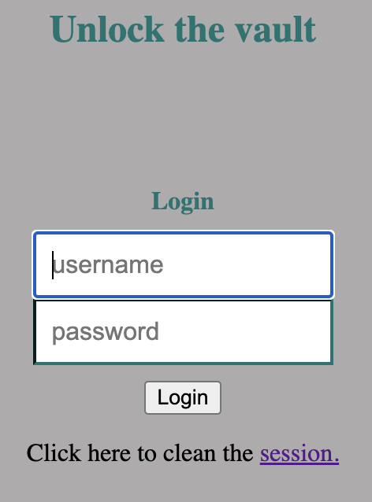
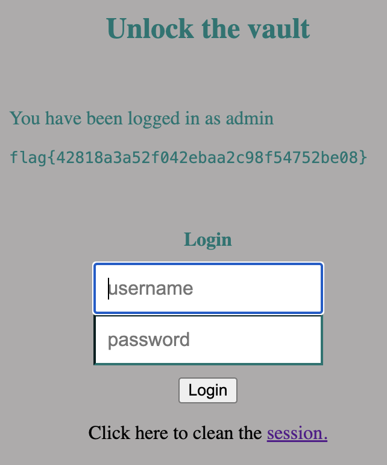

# CTF 8 - SQL Injection

In this CTF, we were presented to a Website that gives the php file to the user everytime he tries to enter the website (This source code is in the appendix of this document). The website looks like this:

<div align="center">
  
</div>


The most important part of the document is this:

```php
<?php
    if (!empty($_POST)) {

        require_once 'config.php';

        $username = $_POST['username'];
        $password = $_POST['password'];
               
        $query = "SELECT username FROM user WHERE username = '".$username."' AND password = '".$password."'";
                                     
        if ($result = $conn->query($query)) {
                                  
            while ($data = $result->fetchArray(SQLITE3_ASSOC)) {
                $_SESSION['username'] = $data['username'];
           
                echo "<p>You have been logged in as {$_SESSION['username']}</p><code>";
                include "/flag.txt";
                echo "</code>";

            }
        } else {            
            // falhou o login
            echo "<p>Invalid username or password <a href=\"index.php\">Tente novamente</a></p>";
        }
    }
?>
```

## Questions

### Q1. Which SQL Query is executed everytime a user tries to login?

Considering that the user is not an attacker, a normal query to a normal input from a user would look like this:

```sql
SELECT username FROM user WHERE username = '<username>' AND password = '<password>'
```

### Q2. Which inputs you can manipulate to encroach the query? Which Special Characters you use and why?

For this exploit, the most important keywords that we might have in mind are:

* `;`: This character is important because it represents the end of an sql statement

* `--`: These two characters together are the declaration of the beggining of a comment in SQL.

* `'`: This character marks the beggining and the end of a string in SQL

### Q3. Which SQL query is effectively executed with your malicious login attempt? Why does this query allow you to login?

To have a successful malicious login attempt, we can use the following input

* Username: `admin';--`
* Password : `Anything that is not empty`

What this will do is to write the username of the user we want to enter in (`admin`). Then we use `'` to close the string that queries to the database the user with that input. Then, we use the `;` to close the. Then we use the `--` to comment everything that comes after the query we want to execute.

The actual query that is done is this one:

```sql
SELECT username FROM user WHERE username = 'admin'; -- AND password = '".$password."'";
```

Which is semanticaly equivelant to this:

```sql
SELECT username FROM user WHERE username = 'admin';
```

which do not require the password to enter into the system.

And the final result is this:


<div align="center">
  
</div>
