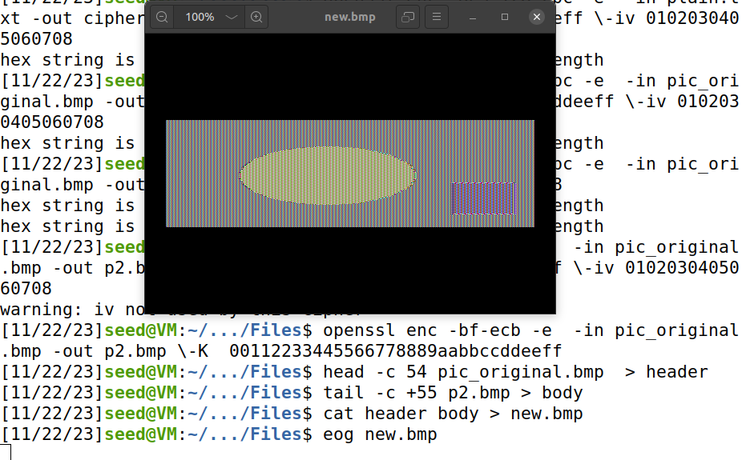
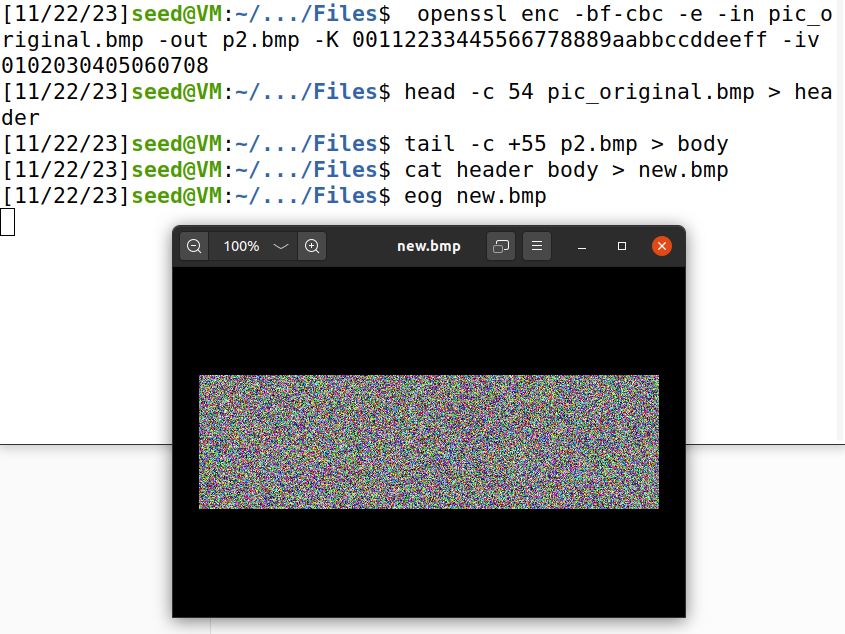

# LOGBOOK10
This logbook documents the work done for week 10 of the FSI course - [link to guide](https://seedsecuritylabs.org/Labs_20.04/Files/Crypto_Encryption/Crypto_Encryption.pdf).

## Setting up
To start, we need to setup the docker container. As we have done this many times before, we will skip to the first task.

## TASK 1
The goal of this task is to de-encrypt a file encripted by a monoalphabetic cipher guiding ourselves by word-frequency analysis.

The encryption table is generated by the following code:

```py
import random

s = "abcdefghijklmnopqrstuvwxyz"
list = random.sample(s, len(s))
key = ’’.join(list)
print(key)
```

Then, the file is simplified by converting all upper cases to lower cases,
and then removeing all the punctuations and numbers.The spaces between words are kept, something that doesn't happen in the real world.

```shell
$ tr [:upper:] [:lower:] < article.txt > lowercase.txt
$ tr -cd ’[a-z][\n][:space:]’ < lowercase.txt > plaintext.txt
```

Lastly, the ``` tr ``` command is used to encrypt:
```shell
tr ’abcdefghijklmnopqrstuvwxyz’ ’<encryption key>’ \
< plaintext.txt > ciphertext.txt
```

Our job is to figure out the encryption table.

By running freq.py, we get the following table:

```
1-gram (top 20):
n: 488
y: 373
v: 348
x: 291
u: 280
q: 276
m: 264
h: 235
t: 183
i: 166
p: 156
a: 116
c: 104
z: 95
l: 90
g: 83
b: 83
r: 82
e: 76
d: 59
-------------------------------------
2-gram (top 20):
yt: 115
tn: 89
mu: 74
nh: 58
vh: 57
hn: 57
vu: 56
nq: 53
xu: 52
up: 46
xh: 45
yn: 44
np: 44
vy: 44
nu: 42
qy: 39
vq: 33
vi: 32
gn: 32
av: 31
-------------------------------------
3-gram (top 20):
ytn: 78
vup: 30
mur: 20
ynh: 18
xzy: 16
mxu: 14
gnq: 14
ytv: 13
nqy: 13
vii: 13
bxh: 13
lvq: 12
nuy: 12
vyn: 12
uvy: 11
lmu: 11
nvh: 11
cmu: 11
tmq: 10
vhp: 10

```

If we consult the wikiedia page of common [bigrams](https://en.wikipedia.org/wiki/Bigram) in english, we come to the conclusion that 'th' is the most common. We can apply similiar logic to our text - the frequency won't be the exact same, but considering that the text is big enough, similar patterns will occur.

If we use this logic, we will gradually discover every letter. To facilitate, after discovering some letters, we can convert them to plain text, using:

```shell
tr ’<E1><E2>’ ’<K1><K2>’ < in.txt > out.txt
```
where E1 and E2 are letters we want to replace and K1 and K2 are the letters we replace them with.

In the end, we get our key:
```
CRYPT => DECRYPT
a => c,
b => f,
c => m,
d => y,
e => p,
f => v,
g => b,
h => r,
i => l,
j => q,
k => x,
l => w,
m => i,
n => e,
o => j,
p => d,
q => s,
r => g,
s => k,
t => h,
u => n,
v => a,
w => z,
x => o,
y => t,
z => u
```

with the text being:
```
THE OSCARS TURN  ON SUNDAY WHICH SEEMS ABOUT RIGHT AFTER THIS LONG STRANGE
AWARDS TRIP THE BAGGER FEELS LIKE A NONAGENARIAN TOO

THE AWARDS RACE WAS BOOKENDED BY THE DEMISE OF HARVEY WEINSTEIN AT ITS OUTSET
AND THE APPARENT IMPLOSION OF HIS FILM COMPANY AT THE END AND IT WAS SHAPED BY
THE EMERGENCE OF METOO TIMES UP BLACKGOWN POLITICS ARMCANDY ACTIVISM AND
A NATIONAL CONVERSATION AS BRIEF AND MAD AS A FEVER DREAM ABOUT WHETHER THERE
OUGHT TO BE A PRESIDENT WINFREY THE SEASON DIDNT JUST SEEM EXTRA LONG IT WAS
EXTRA LONG BECAUSE THE OSCARS WERE MOVED TO THE FIRST WEEKEND IN MARCH TO
AVOID CONFLICTING WITH THE CLOSING CEREMONY OF THE WINTER OLYMPICS THANKS
PYEONGCHANG

ONE BIG QUESTION SURROUNDING THIS YEARS ACADEMY AWARDS IS HOW OR IF THE
CEREMONY WILL ADDRESS METOO ESPECIALLY AFTER THE GOLDEN GLOBES WHICH BECAME
A JUBILANT COMINGOUT PARTY FOR TIMES UP THE MOVEMENT SPEARHEADED BY 
POWERFUL HOLLYWOOD WOMEN WHO HELPED RAISE MILLIONS OF DOLLARS TO FIGHT SEXUAL
HARASSMENT AROUND THE COUNTRY

SIGNALING THEIR SUPPORT GOLDEN GLOBES ATTENDEES SWATHED THEMSELVES IN BLACK
SPORTED LAPEL PINS AND SOUNDED OFF ABOUT SEXIST POWER IMBALANCES FROM THE RED
CARPET AND THE STAGE ON THE AIR E WAS CALLED OUT ABOUT PAY INEQUITY AFTER
ITS FORMER ANCHOR CATT SADLER QUIT ONCE SHE LEARNED THAT SHE WAS MAKING FAR
LESS THAN A MALE COHOST AND DURING THE CEREMONY NATALIE PORTMAN TOOK A BLUNT
AND SATISFYING DIG AT THE ALLMALE ROSTER OF NOMINATED DIRECTORS HOW COULD
THAT BE TOPPED

AS IT TURNS OUT AT LEAST IN TERMS OF THE OSCARS IT PROBABLY WONT BE

WOMEN INVOLVED IN TIMES UP SAID THAT ALTHOUGH THE GLOBES SIGNIFIED THE
INITIATIVES LAUNCH THEY NEVER INTENDED IT TO BE JUST AN AWARDS SEASON
CAMPAIGN OR ONE THAT BECAME ASSOCIATED ONLY WITH REDCARPET ACTIONS INSTEAD
A SPOKESWOMAN SAID THE GROUP IS WORKING BEHIND CLOSED DOORS AND HAS SINCE
AMASSED  MILLION FOR ITS LEGAL DEFENSE FUND WHICH AFTER THE GLOBES WAS
FLOODED WITH THOUSANDS OF DONATIONS OF  OR LESS FROM PEOPLE IN SOME 
COUNTRIES


NO CALL TO WEAR BLACK GOWNS WENT OUT IN ADVANCE OF THE OSCARS THOUGH THE
MOVEMENT WILL ALMOST CERTAINLY BE REFERENCED BEFORE AND DURING THE CEREMONY 
ESPECIALLY SINCE VOCAL METOO SUPPORTERS LIKE ASHLEY JUDD LAURA DERN AND
NICOLE KIDMAN ARE SCHEDULED PRESENTERS

ANOTHER FEATURE OF THIS SEASON NO ONE REALLY KNOWS WHO IS GOING TO WIN BEST
PICTURE ARGUABLY THIS HAPPENS A LOT OF THE TIME INARGUABLY THE NAILBITER
NARRATIVE ONLY SERVES THE AWARDS HYPE MACHINE BUT OFTEN THE PEOPLE FORECASTING
THE RACE SOCALLED OSCAROLOGISTS CAN MAKE ONLY EDUCATED GUESSES

THE WAY THE ACADEMY TABULATES THE BIG WINNER DOESNT HELP IN EVERY OTHER
CATEGORY THE NOMINEE WITH THE MOST VOTES WINS BUT IN THE BEST PICTURE
CATEGORY VOTERS ARE ASKED TO LIST THEIR TOP MOVIES IN PREFERENTIAL ORDER IF A
MOVIE GETS MORE THAN  PERCENT OF THE FIRSTPLACE VOTES IT WINS WHEN NO
MOVIE MANAGES THAT THE ONE WITH THE FEWEST FIRSTPLACE VOTES IS ELIMINATED AND
ITS VOTES ARE REDISTRIBUTED TO THE MOVIES THAT GARNERED THE ELIMINATED BALLOTS
SECONDPLACE VOTES AND THIS CONTINUES UNTIL A WINNER EMERGES

IT IS ALL TERRIBLY CONFUSING BUT APPARENTLY THE CONSENSUS FAVORITE COMES OUT
AHEAD IN THE END THIS MEANS THAT ENDOFSEASON AWARDS CHATTER INVARIABLY
INVOLVES TORTURED SPECULATION ABOUT WHICH FILM WOULD MOST LIKELY BE VOTERS
SECOND OR THIRD FAVORITE AND THEN EQUALLY TORTURED CONCLUSIONS ABOUT WHICH
FILM MIGHT PREVAIL

IN  IT WAS A TOSSUP BETWEEN BOYHOOD AND THE EVENTUAL WINNER BIRDMAN
IN  WITH LOTS OF EXPERTS BETTING ON THE REVENANT OR THE BIG SHORT THE
PRIZE WENT TO SPOTLIGHT LAST YEAR NEARLY ALL THE FORECASTERS DECLARED LA
LA LAND THE PRESUMPTIVE WINNER AND FOR TWO AND A HALF MINUTES THEY WERE
CORRECT BEFORE AN ENVELOPE SNAFU WAS REVEALED AND THE RIGHTFUL WINNER
MOONLIGHT WAS CROWNED

THIS YEAR AWARDS WATCHERS ARE UNEQUALLY DIVIDED BETWEEN THREE BILLBOARDS
OUTSIDE EBBING MISSOURI THE FAVORITE AND THE SHAPE OF WATER WHICH IS
THE BAGGERS PREDICTION WITH A FEW FORECASTING A HAIL MARY WIN FOR GET OUT

BUT ALL OF THOSE FILMS HAVE HISTORICAL OSCARVOTING PATTERNS AGAINST THEM THE
SHAPE OF WATER HAS  NOMINATIONS MORE THAN ANY OTHER FILM AND WAS ALSO
NAMED THE YEARS BEST BY THE PRODUCERS AND DIRECTORS GUILDS YET IT WAS NOT
NOMINATED FOR A SCREEN ACTORS GUILD AWARD FOR BEST ENSEMBLE AND NO FILM HAS
WON BEST PICTURE WITHOUT PREVIOUSLY LANDING AT LEAST THE ACTORS NOMINATION
SINCE BRAVEHEART IN  THIS YEAR THE BEST ENSEMBLE SAG ENDED UP GOING TO
THREE BILLBOARDS WHICH IS SIGNIFICANT BECAUSE ACTORS MAKE UP THE ACADEMYS
LARGEST BRANCH THAT FILM WHILE DIVISIVE ALSO WON THE BEST DRAMA GOLDEN GLOBE
AND THE BAFTA BUT ITS FILMMAKER MARTIN MCDONAGH WAS NOT NOMINATED FOR BEST
DIRECTOR AND APART FROM ARGO MOVIES THAT LAND BEST PICTURE WITHOUT ALSO
EARNING BEST DIRECTOR NOMINATIONS ARE FEW AND FAR BETWEEN
```


## TASK 2

For this task, we will use different encryption modes, with the following command:
```shell
$ openssl enc -ciphertype -e -in plain.txt -out cipher.bin \
-K 00112233445566778889aabbccddeeff \
-iv 0102030405060708
```
We will use these 3 ciphers:
``` 
-aes-128-cbc, -bf-cbc, -aes-128-cfb
```
Some information:

AES is a widely used symmetric encryption algorithm. It uses a 128-bit block size and supports key sizes of 128, 192, or 256 bits.

AES-CBC mode means that each plaintext block is XORed with the previous ciphertext block before encryption, adding complexity and security. It requires an Initialization Vector for encryption, and it's suitable for secure data transmission and storage.

AES-CFB mode turns a block cipher into a stream cipher, where each plaintext block is encrypted and then XORed with the plaintext to create the ciphertext Like AES-CBC, it requires an IV. CFB can operate in different bit modes (128, 192, or 256). It's useful in cases where streaming data needs to be encrypted in smaller chunks without waiting for the entire block.

BF is a symmetric key block cipher that operates on variable-length blocks (32 to 448 bits). CBC mode operates similarly to AES-CBC, XORing each plaintext block with the previous ciphertext block before encryption. BF was designed as a general-purpose algorithm and was popular for a time but is less commonly used today, especially compared to AES.

## TASK 3
In this task, we want to encrypt a picture and take a look at the output.

What we do is concatenate the header of the original picture with an encrypted body.

We use 2 ciphers, cbc and ebc.

Here are the commands and output:





As we can see, ECB is not as good when it comes to phoyo encryption. This happens because of its deterministic nature. Each identical block of plaintext will be encrypted into the same ciphertext block. For photos or images, that contain repetitive patterns or large areas of uniform color, this results in recognizable patterns in the encrypted output.

ECB is good for disk encryption, as the probability of finding similar blocks is not as high.

CBC is very good with images, as we can see, becuase CBC XORs each plaintext block with the previous ciphertext block before encryption. This ensures that even small changes in the input (like altering a pixel in an image) will propagate throughout the entire encrypted image. This diffusion helps prevent recognizable patterns, making it harder for attackers to know information about the image from the ciphertext.
