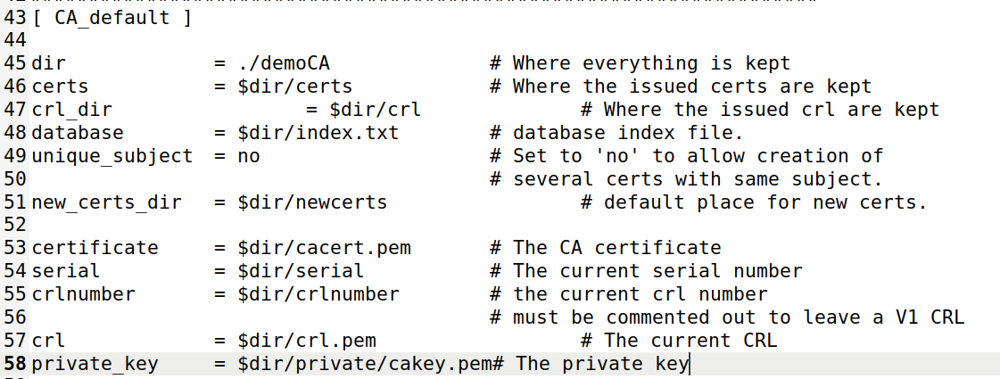
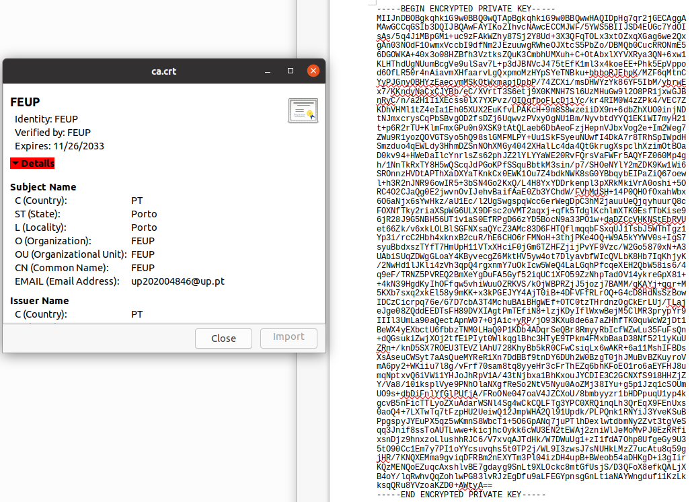
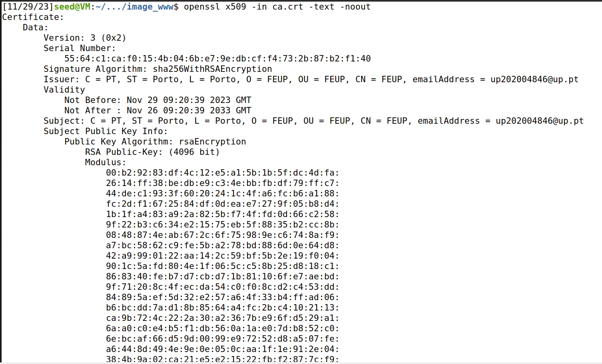
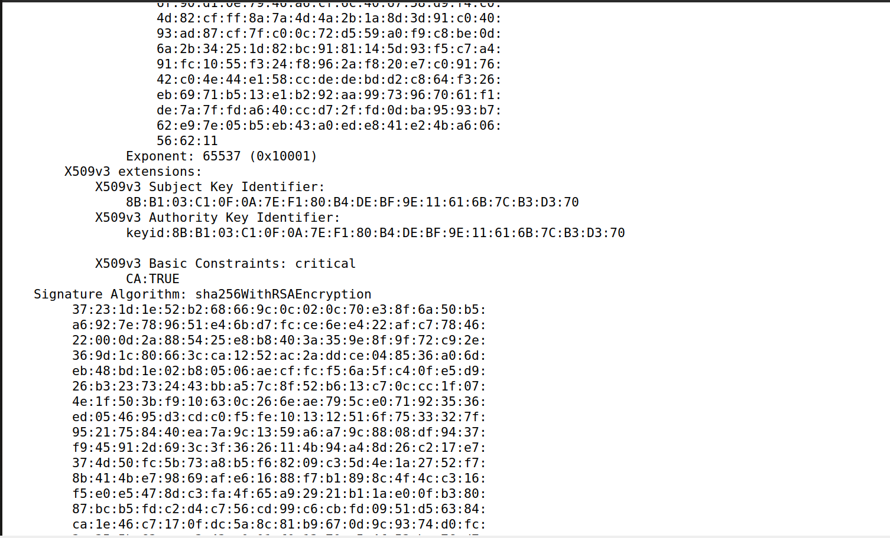
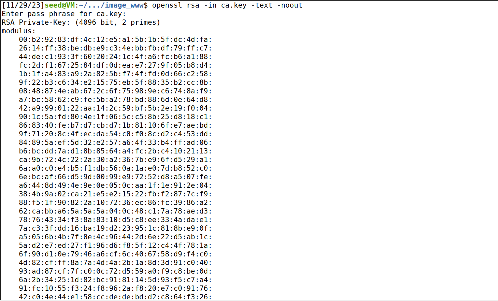
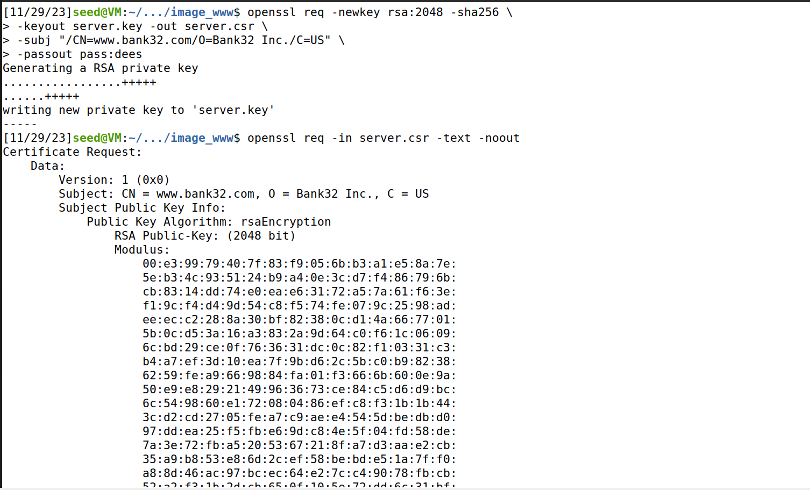
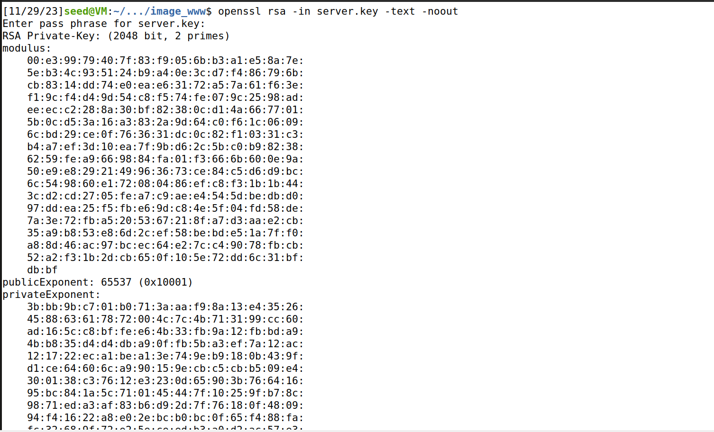

# LOGBOOK11
This logbook documents the work done for week 11 of the FSI course - [link to guide](https://seedsecuritylabs.org/Labs_20.04/Files/Crypto_PKI/Crypto_PKI.pdf).

## Setting up
To start, we need to setup the docker container. As we have done this many times before, we will skip this step.

We also need to add the following lines to our etc/hosts file:
```
10.9.0.80 www.bank32.com
10.9.0.80 www.smith2020.com
```

## TASK 1
First, we need to configure openssl.cnf.



Then, we create a new certificate and private key to our CA, using the following command:

```shell
openssl req -x509 -newkey rsa:4096 -sha256 -days 3650 \
-keyout ca.key -out ca.crt
```

We will get two files, ca.key, with the CA probvate key, and ca.crt, with the public key certificate:






Since the subject and issuer are the same, the certificate is self-signed.

The certificate is a CA certificate because certificate authority is set to "Yes"

Prime1 represents p and Prime2 represents q, in n= p*q, where n is the modulus used in RSA.

## TASK 2
In this task, we generate a CSR, using this command:
```shell
openssl req -newkey rsa:2048 -sha256 \
-keyout server.key -out server.csr \
-subj "/CN=www.bank32.com/O=Bank32 Inc./C=US" \
-passout pass:dees

```

We then print the output:
```shell
openssl req -in server.csr -text -noout
openssl rsa -in server.key -text -noout
```




Mext, we run the same command, but adding the following commands to allow 2 aliases of the website:

```shell
-addext "subjectAltName = DNS:www.bank32.com, \
DNS:www.bank32A.com, \
DNS:www.bank32B.com"
```

## TASK 3


## TASK 4


## TASK 5


## TASK 6
