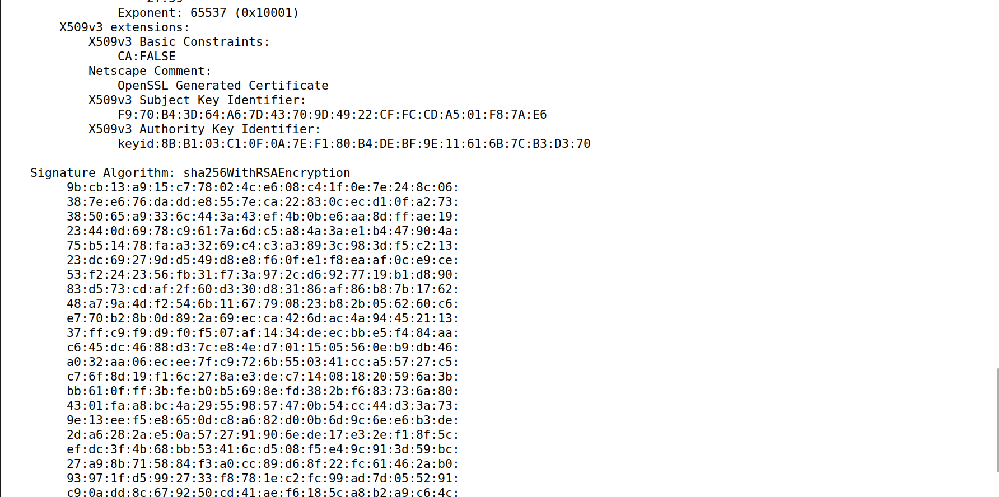

# LOGBOOK 11
This logbook documents the work done for week 11 of the FSI course - [link to guide](https://seedsecuritylabs.org/Labs_20.04/Files/Crypto_PKI/Crypto_PKI.pdf).

## Setting up
To start, we need to setup the docker container. As we have done this many times before, we will skip this step.

We also need to add the following lines to our etc/hosts file:
```
10.9.0.80 www.bank32.com
10.9.0.80 www.smith2020.com
```

## TASK 1
First, we need to configure openssl.cnf.


Then, we create a new certificate and private key to our CA, using the following command:

```shell
openssl req -x509 -newkey rsa:4096 -sha256 -days 3650 \
-keyout ca.key -out ca.crt
```

We will get two files, ca.key, with the CA probvate key, and ca.crt, with the public key certificate:


Since the subject and issuer are the same, the certificate is self-signed.

The certificate is a CA certificate because certificate authority is set to "Yes"

Prime1 represents p and Prime2 represents q, in n= p*q, where n is the modulus used in RSA.

## TASK 2
In this task, we generate a CSR, using this command:
```sh
openssl req -newkey rsa:2048 -sha256 \
-keyout server.key -out server.csr \
-subj "/CN=www.bank32.com/O=Bank32 Inc./C=US" \
-passout pass:dees

```

We then print the output:
```sh
openssl req -in server.csr -text -noout
openssl rsa -in server.key -text -noout
```


Mext, we run the same command, but adding the following commands to allow 2 aliases of the website:

```sh
-addext "subjectAltName = DNS:www.bank32.com, \
DNS:www.bank32A.com, \
DNS:www.bank32B.com"
```

## TASK 3
For task 3, we want to user our CA to generate certificates. We use the following command to generate a X509 certificate (server.crt):
```shell
openssl ca -config myCA_openssl.cnf -policy policy_anything \
-md sha256 -days 3650 \
-in server.csr -out server.crt -batch \
-cert ca.crt -keyfile ca.key
```

We need to create a demoCA/newcerts dir, as well as copy index.txt and serial.txt to demoCA.
Only then will we have success


After removing the comment from ``` copy_extensions = copy ```, we print the output:



## TASK 4
In this task, we will check how PK certificates are used by websites.

First, we need to setup the docker container.

Then, we take a look at the configuration of bank32_apache_ssl, where we can see the different aliases.


If we visit www.bank32.com, we get the following page. We can also see the certificate information. The browser doesn't trust it, as it wasn't signed by a trusted CA authority.


We can, however, import our own certificate, ca.crt.


Then, we copy server.crt and server.key to the volumes folder, and alter bank32_apache_ssl.conf on the terminal:


Finally, if we restart apache and access bank32, we can see that it is now trusted


## TASK 5
This task shows us how PKI protect us from Man in the Middle Attacks.
First, let's add www.instagram.com to the DNS list:


Then, let's try to access it:


As we can see, the browser denies it.

This happens because even though www.instagram.com is a real website and it gives the browser a real certificate validated by a trusted CA, the certificate does not match with instagram.com, but with bank32.com.


## TASK 6
Let's assume the attacker has control ovver the CA.

If we create a new CSR to the CA to validate our website, generate a new certificate and substitute the old certificate and private key for the new ones, we will be able to establish a "safe" connection with the website
