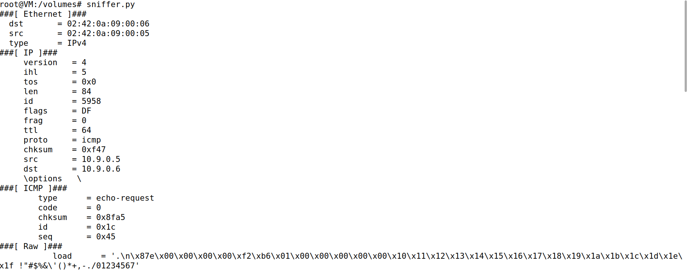
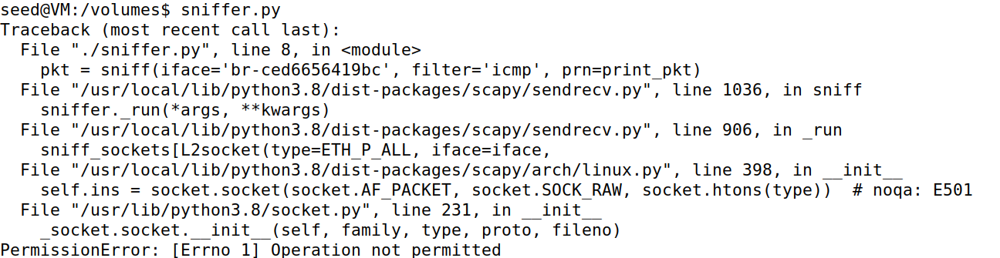
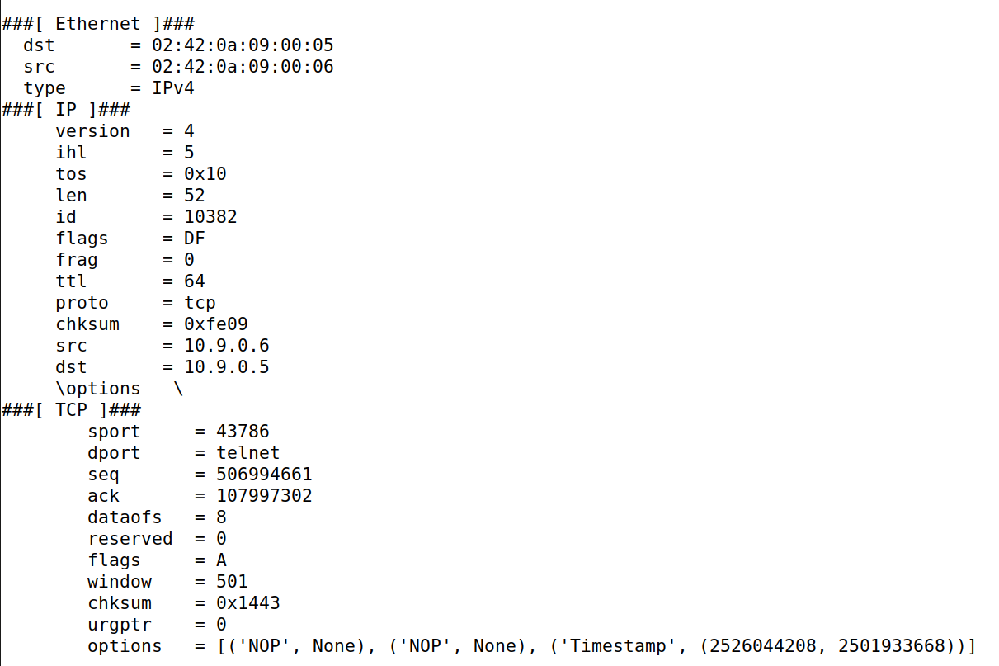
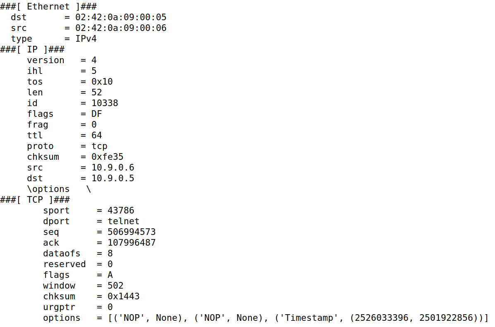

# LOGBOOK13 - Sniffing and Spoofing

The goal of the work this week is to understand mechanisms for monitoring and manipulating traffic.

## Task 1.1 - Sniffing Packets

The first step on this task is to go to the terminal of the attacker container and to use the `ifconfig` command to find out what is the name of the interface. We found out that the name of the interface is: `br-ced6656419bc`.

Then, we go to the shared folder `volumes` in the attacker terminal and create a file named `sniffer.py` with the following code that was suggested in the guide:

```py
#!/usr/bin/env python3

from scapy.all import *

def print_pkt(pkt):
  pkt.show()

pkt = sniff(iface='br-ced6656419bc', filter='icmp', prn=print_pkt)
```

Then, we used the command `chmod a+x sniffer.py` to make this program executable.

Then the objective is to ping the HostB from HostA. To do that, we need to get the ip from the Host B machine. That could be done with the command `ifconfig`. We found out that the IP of the Host B machine is `ping 10.9.0.6`. Then, what we must do is to `ping 10.9.0.6` in Host A machine. This is what we found on the attacker machine:



Then, we used `su seed` command to try to run the code withoud root privileges, which leads us to an error:



Para capturar quaisquer **_TCP packets_ provenientes de um IP específico e com uma porta de destino com o número 23**, alteramos a seguinte linha do ficheiro ```task1A.py```, inserindo no _filter_ o ip do **_hostB container_** e a porta de destino 23.

The next challange that was proposed to us is to capture any TCP packets that comes from a specific destination port with the number 23. For that, it was just need to change the last line of `sniffer.py`:

```py
pkt = sniff(iface='br-ced6656419bc', filter='tcp and src host 10.9.0.6 and dst port 23', prn=print_pkt))
```

Then after this changes, we ran the code again and reached the following output:



For the last filter we did this: 

```py
pkt = sniff(iface='br-ced6656419bc', filter='dst net 128.230.0.0/16', prn=print_pkt))
```

And the output was:



