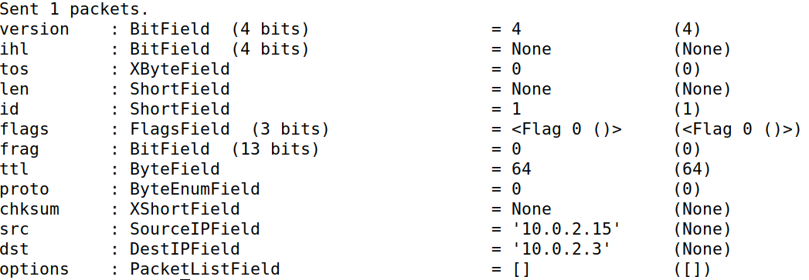

# LOGBOOK 13 - Sniffing and Spoofing

This week's focus was on understanding mechanisms for monitoring and manipulating network traffic.

## Task 1.1 - Sniffing Packets

The initial step involved identifying the network interface on the attacker container using the `ifconfig` command, which revealed the interface name as `br-ced6656419bc`. A Python script named `sniffer.py` was created in the shared folder `volumes` based on the provided guide. This script utilized Scapy to sniff and display ICMP packets on the specified interface.

```py
#!/usr/bin/env python3

from scapy.all import *

def print_pkt(pkt):
  pkt.show()

pkt = sniff(iface='br-ced6656419bc', filter='icmp', prn=print_pkt)
```

Then, we used the command `chmod a+x sniffer.py` to make this program executable.

Then the objective is to ping the HostB from HostA. To do that, we need to get the ip from the Host B machine. That could be done with the command `ifconfig`. We found out that the IP of the Host B machine is `ping 10.9.0.6`. Then, what we must do is to `ping 10.9.0.6` in Host A machine. This is what we found on the attacker machine:


Then, we used `su seed` command to try to run the code withoud root privileges, which leads us to an error:


The next challange that was proposed to us is to capture any TCP packets that comes from a specific destination port with the number 23. For that, it was just need to change the last line of `sniffer.py`:

```py
pkt = sniff(iface='br-ced6656419bc', filter='tcp and src host 10.9.0.6 and dst port 23', prn=print_pkt))
```

Then after this changes, we ran the code again and reached the following output:


For the last filter we did this: 

```py
pkt = sniff(iface='br-ced6656419bc', filter='dst net 128.230.0.0/16', prn=print_pkt))
```

And the output was:


## Task 1.2 - Spoofing ICMP Packets

For this task, another file names `spoofer.py` was created for the testing. It was based on the template that was given in the guide:

```py
#!/usr/bin/env python3

from scapy.all import *

a = IP()
a.dst = '10.0.2.3'
b = ICMP()
p = a/b
send(p)

ls(a)
```

Then, once again we ran  `chmod a+x spoofer.py`. After that, we opened the Wireshark and selected the attacker interface, `enp0s3`. After that, we ran the program `spoofer.py` and see the results:




We can see that there is a packet that have the same source IP that the attacker container. The destinity of the IP addres is the one that we have defined before, `10.2.0.3`.

## Task 1.3 - Traceroute

For this task, it was created a file name `traceroute.py`. Once again, this file was already given in the template. However, the program as previously changes to address more than one values of Time to Live (TTl).

```py
#!/usr/bin/env python3
from scapy.all import *

for ttl in range(1, 16):
  a = IP()
  a.dst = '8.8.8.8'
  b = ICMP()
  a.ttl = ttl
  send(a/b)
```

The capture was started in wireshark and the program was ran, showing the following output:


## Task 1.4 - Sniffing and-then Spoofing

For this task, it was create a file named `sniffing_spoofing.py` to solve us the problem.

```py
#!/usr/bin/env python3

from scapy.all import *

def spoof(packet):

    if ICMP in packet and packet[ICMP].type == 8:
        print("-----Original-----")
        print("Src IP : ", packet[IP].src)
        print("Dest IP :", packet[IP].dst)

        ip = IP(src=packet[IP].dst, dst=packet[IP].src, ihl=packet[IP].ihl)
        icmp = ICMP(type=0, id=packet[ICMP].id, seq=packet[ICMP].seq)
        data = packet[Raw].load
        newpacket = ip/icmp/data

        print("-----Spoofed-----")
        print("Source IP : ", newpacket[IP].src)
        print("Destination IP :", newpacket[IP].dst)

        send(newpkt, verbose=0)

packet = sniff(iface='br-ced6656419bc', filter='icmp and host 1.2.3.4', prn=spoof)

```

The ideia is to run the following script in the attacker machine and use the host A machine to ping what is necessary. The first ping we use is `ping 1.2.3.4`: The result is the following:

  

In the host machine the resukt is the following:


