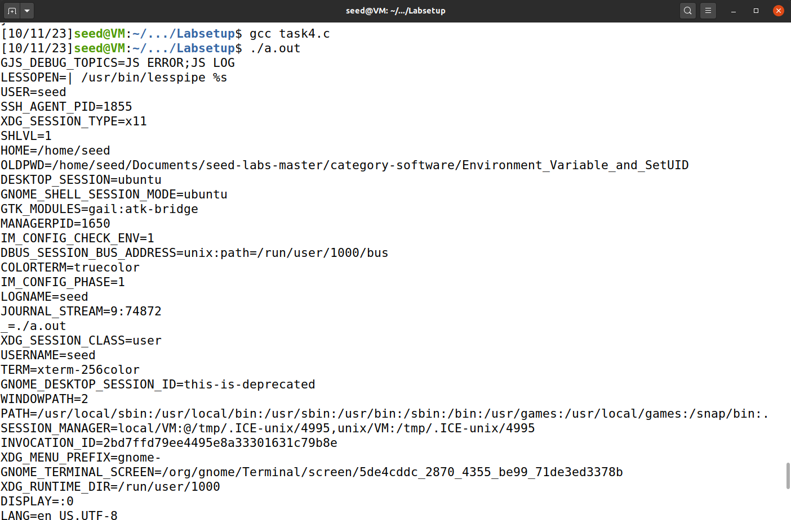

# LOGBOOK4

This document pretends to document the work that was  during week 4 of the FSI course - (link to guide) [https://seedsecuritylabs.org/Labs_20.04/Files/Environment_Variable_and_SetUID/Environment_Variable_and_SetUID.pdf]

## Task 1: Manipulating Environment Variables

In this task, the goal was to confirm what environment variables exist.

```SHELL
env # we could also use printenv
```


Or, if we want, we could also use the command for checking one environment variable specifically, in this example, we are using variable PWD as an example:

```SHELL
env PWD # we could also use printenv
```


## Task 2: Passing Environment Variables from Parent Process to Child Process

The next task was to compile the code that creates a new process. This new process (the child) becomes a duplicate of the parent process (we used fork() function).

After compiling the code and save them into different files, we found out that the outputs were the same, which concludes that, using the fork method, the envirnoment variables of the child process are the same as the ones that are in the parent envirnoment variable.

```SHELL
gcc myprintenv.c
a.out > file
```


## Task 3: Environment Variables and execve()

This task studies how environment variables are affected when a new program is executed via execve(), a function that runs the new program inside a system calling process.

After compilation of the given code, we can see that there is no return. However, after changing NULL to environ, we can see that the environment variables are returned. This is due to the fact that environ is defined by unistd.h and is the list of environment variables of the system, that are inherited by the program.

```SHELL
gcc myenv.c -o myenv
./myenv
```


## Task 4: Environment Variables and system()

In this task, we explore how environment variables are handled when a new program is executed through the system() function. Unlike execve(), which directly runs a command, system() invokes /bin/sh -c command, essentially launching a shell to execute the specified command. The implementation of system() relies on execl(), which in turn employs execve() while passing along the environment variables array. Consequently, when using system(), the environment variables of the calling process are inherited and passed to the new program executed by /bin/sh.

After the compilation of the given code, we obtain this result.





## Task 5: Environment Variables and Set-UID Programs

Set-UID is a crucial security feature in Unix systems, enabling programs to run with the privileges of their owners. While Set-UID offers powerful capabilities, it poses significant security risks due to privilege escalation. Importantly, while a Set-UID program's behavior is determined by its code, users can indirectly influence it through environment variables. To assess this impact, it's essential to determine whether environment variables are inherited by Set-UID program processes from the user's processes.

After the compilation of the given code, we execute the commands below in order to change the permissions.

```SHELL
sudo chown root foo
sudo chmod 4755 foo
```

After changing the permissions, we run the following command on the shell, as a normal user.

```SHELL
export LD_LIBRARY_PATH=/home/seed
```

The child process inherits PATH and LD_LIBRARY_PATH, but doesn't inherit the variable we set ourselves, as a security measure to maintain the security of privileged processes and prevent unauthorized users from influencing them through environment variables.


## Task 6: The PATH Environment Variable and Set-UID Programs

Calling system() within a Set-UID program is quite dangerous, since the behavior of the shell program invoked can be influenced by user-provided environment variables, notably the PATH variable. The ability for malicious users to manipulate these variables, such as altering the PATH to include specific directories, can lead to substantial control over the behavior of the Set-UID program.

In Bash, the PATH environment variable can be changed by running the code below:

```SHELL
export PATH=/home/seed/Documents/seed-labs-master/category-software/Environment_Variable_and_SetUID/Labsetup:$PATH
```

We also had to run the following command in order to not have problems with the countermeasures from dash.

```SHELL
sudo ln -sf /bin/zsh /bin/sh
```

In the lab, we created our malicious program that is shown below. It was supposed to be able to change the file's permissions.

``` c
#include <stdio.h>
#include <stdlib.h>

int main() {

    printf("Malicious code\n");
    system("chmod 777 /home/seed/Documents/seed-labs-master/category-software/Environment_Variable_and_SetUID/Labsetup/important_file");

    return 0;
}
```

By altering the PATH environment variable to include a directory where a malicious script or binary with the same name as the intended command (in this case, ls) is located, the system will execute the malicious code instead of the intended command when the Set-UID program is invoked.

If the Set-UID program is running with root privileges and a malicious user manages to execute their own code instead of /bin/ls, then their malicious code would also run with root privileges.


